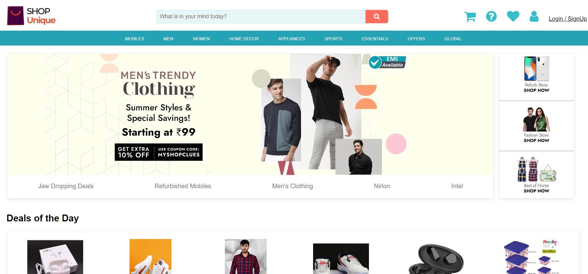

===================PROJECT DETAILS==================

Project Code : literate-needle-3714 
Project Website : Shopclues.com 
Cloned Name : ShopUnique.com 
Tech Stacks : HTML, CSS, JS, Express, Node, MongoDB Atlas 
Duration : 5 Days 
Responsive : Fully Responsive 

===================PROJECT BRIEFING==================

# ShopUnique
Shop Unique is a web application that is designed to mimic the functionality of an e-commerce website like Shopclues. It is built using HTML, CSS, JS, Express, Node and MongoDB Atlas. With Shop Unique, users can browse and search for products, add them to their cart, and checkout. Additionally, admins can manage the products, categories, and users on the site.

# Folder Structure

shop-unique/ 
├── middlewares/ 
│   ├── auth.js 
│   │ 
├── models/ 
│   ├── product.model.js 
│   ├── user.model.js 
│   │ 
├── routes/ 
│   ├── product.route.js 
│   ├── user.route.js 
├── view/ 
│   ├── admin.html 
│   ├── cart.html 
│   ├── index.html 
│   ├── mensProduct.html 
│   ├── payment.html 
│   ├── productDetail.html 
│   ├── signup.html 
│   ├── thankyou.html 
│   │ 
│   ├── scripts/ 
│   │   ├── admin.js 
│   │   ├── cart.js 
│   │   ├── main.js 
│   │   ├── mensProduct.js 
│   │   ├── payment.js 
│   │   └── productDetails.js 
│   │   └── signup.js 
│   │ 
│   ├── styles/ 
│   │   ├── admin.css 
│   │   ├── cart.css 
│   │   ├── index.css 
│   │   ├── mensProduct.css 
│   │   ├── payment.css 
│   │   └── productDetails.css 
│   │   └── signup.css 
│   │   └── thankyou.css 
│   │ 
├── .gitIgnore 
├── db.js 
├── index.js 
├── package-lock.json 
├── package.json 
└── README.md

# Dependencies

The project uses the following dependencies:
* bcrypt
* cors
* dotenv
* express
* jsonwebtoken
* mongodb
* mongoose
* nodemmon

# Deployment
* Frontend is deployed on Netlify 
 FrontEnd : https://literate-needle-3714.netlify.app/  

 * Backend is deployed on Cyclic 
 Backend : https://stormy-flannel-shirt-ox.cyclic.app/  

# Running the Website
You can simply run a website by clicking on netlify link given above. 

If there is any server side error while running you can simply run frontend by netlify link and To run the server, use the npm run server. This will start the server and make the data accessible at http://localhost:4500. 

# Some snaps of Website

* Home Page 

* Login/SignUp Page 

* Product Page 

* Admin Panel 

